# 📚 PHÂN LOẠI PHONG CÁCH NGHỆ THUẬT BẰNG DEEP LEARNING

---

## MỤC LỤC

1. [GIỚI THIỆU & MỤC TIÊU](#1-introduction-objectives)
2. [TỔNG QUAN KIẾN TRÚC & LUỒNG XỬ LÝ](#2-overall-architecture-workflow)
3. [CẤU TRÚC THƯ MỤC & Ý NGHĨA CÁC FILE](#3-directory-structure-file-meanings)
4. [CÀI ĐẶT MÔI TRƯỜNG & CHUẨN BỊ PHẦN CỨNG](#4-environment-setup-hardware-preparation)
5. [CHUẨN BỊ DỮ LIỆU & XỬ LÝ LỖI DỮ LIỆU](#5-data-preparation-error-handling)
6. [HƯỚNG DẪN SỬ DỤNG CHO NGƯỜI DÙNG CUỐI](#6-end-user-usage-guide)
7. [HƯỚNG DẪN CHO DEVELOPER & MỞ RỘNG](#7-developer-guide-extensions)
8. [GIẢI THÍCH CHI TIẾT TỪNG FILE & LUỒNG XỬ LÝ](#8-detailed-file-explanations-processing-flows)
    - [constants.py](#constants.py)
    - [data_collector.py](#data_collector.py)
    - [train_model.py](#train_model.py)
    - [test_model.py](#test_model.py)
    - [01_setup.bat](#01_setup.bat)
    - [02_run_train.bat](#02_run_train.bat)
    - [03_run_test.bat](#03_run_test.bat)
    - [requirements.txt](#requirements.txt)
9. [QUY TRÌNH HUẤN LUYỆN, KIỂM TRA & BÁO CÁO KẾT QUẢ](#9-training-testing-result-reporting-process)
10. [VÍ DỤ ĐẦU RA, LOG, CONFUSION MATRIX, SAMPLE PREDICTION](#10-example-outputs-logs-confusion-matrix-sample-prediction)
11. [TROUBLESHOOTING & PERFORMANCE TUNING](#11-troubleshooting-performance-tuning)
12. [BEST PRACTICES & QUẢN LÝ MÔI TRƯỜNG](#12-best-practices-environment-management)
13. [TÀI LIỆU THAM KHẢO, LIÊN HỆ, ĐÓNG GÓP](#13-references-contact-contributions)
14. [SƠ ĐỒ CHI TIẾT CÁC LUỒNG XỬ LÝ TRONG CODE](#14-detailed-code-flow-diagrams)

---

<a id="1-introduction-objectives"></a>
## 1. GIỚI THIỆU & MỤC TIÊU

### Giới thiệu

Dự án này xây dựng hệ thống phân loại phong cách nghệ thuật sử dụng mạng nơ-ron tích chập (CNN) với mô hình Xception (transfer learning). Hệ thống nhận diện 5 phong cách: Baroque, Expressionism, Cubism, Japanese Art, Art Nouveau Modern. Ứng dụng thực tế: phân loại ảnh nghệ thuật, hỗ trợ bảo tàng, gallery, nghiên cứu lịch sử nghệ thuật, xây dựng app nhận diện tự động.

Dự án sử dụng kỹ thuật học máy sâu để phân tích các đặc trưng thị giác của tác phẩm nghệ thuật. Mô hình được huấn luyện trên tập dữ liệu WikiArt, một bộ dữ liệu lớn chứa hàng nghìn bức tranh từ các phong cách khác nhau. Việc sử dụng transfer learning từ mô hình Xception đã được huấn luyện trên ImageNet giúp mô hình học nhanh hơn và đạt độ chính xác cao hơn so với việc huấn luyện từ đầu.

### Mục tiêu

- Tự động nhận diện phong cách nghệ thuật từ ảnh.
- Dễ sử dụng cho người dùng cuối (batch file) và dễ mở rộng cho developer (script Python).
- Quản lý dữ liệu, mô hình, log tập trung qua file `constants.py`.
- Hỗ trợ GPU, tối ưu hóa tốc độ huấn luyện và kiểm tra.
- Có thể mở rộng thêm class, mô hình, hoặc tích hợp vào hệ thống lớn hơn.

Mục tiêu chính là tạo ra một công cụ dễ sử dụng nhưng mạnh mẽ, có thể được tích hợp vào các ứng dụng thực tế như ứng dụng di động nhận diện nghệ thuật, hệ thống quản lý bộ sưu tập, hoặc công cụ nghiên cứu tự động.

---

<a id="2-overall-architecture-workflow"></a>
## 2. TỔNG QUAN KIẾN TRÚC & LUỒNG XỬ LÝ

### Sơ đồ tổng quan

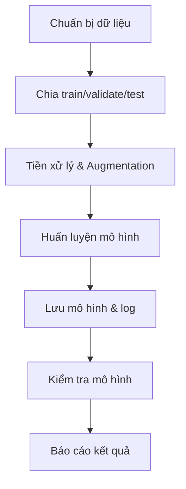

### Luồng xử lý chính

1. Kiểm tra dữ liệu gốc và dữ liệu đã chia
2. Chia dữ liệu tự động nếu cần
3. Tiền xử lý ảnh, augmentation
4. Xây dựng mô hình Xception, thêm các lớp custom
5. Huấn luyện 2 giai đoạn (freeze/unfreeze)
6. Lưu mô hình, log từng lần chạy
7. Kiểm tra mô hình, xuất báo cáo, confusion matrix, ví dụ dự đoán

Luồng xử lý được thiết kế để tự động hóa tối đa, từ việc chuẩn bị dữ liệu đến đánh giá mô hình. Điều này giúp người dùng cuối có thể chạy toàn bộ quy trình chỉ với vài cú click, trong khi developer có thể tùy chỉnh từng bước.

---

<a id="3-directory-structure-file-meanings"></a>
## 3. CẤU TRÚC THƯ MỤC & Ý NGHĨA CÁC FILE

```text
ttnt/
│
├─ kaggle/
│   ├─ input/
│   │   └─ wikiart/
│   │       ├─ Baroque/
│   │       ├─ Expressionism/
│   │       ├─ Cubism/
│   │       ├─ Japanese_Art/
│   │       └─ Art_Nouveau_Modern/
│   └─ working/
│       └─ art_styles/
│           ├─ train/[class]/
│           ├─ validate/[class]/
│           └─ test/[class]/
├─ app_log/           # Log huấn luyện, mỗi lần chạy tạo file riêng
├─ train_model.py     # Script huấn luyện, lưu mô hình, log
├─ test_model.py      # Script kiểm tra mô hình, xuất báo cáo
├─ data_collector.py  # Script chia dữ liệu tự động
├─ constants.py       # Đường dẫn, hằng số dùng chung
├─ 01_setup.bat       # Kiểm tra dữ liệu, hướng dẫn tải
├─ 02_run_train.bat   # Tự động huấn luyện
├─ 03_run_test.bat    # Tự động kiểm tra mô hình
├─ requirements.txt   # Thư viện Python
└─ README.md          # Hướng dẫn chi tiết
```

### Ý nghĩa các file/folder

- **kaggle/input/wikiart/**: Dữ liệu gốc, mỗi class là một thư mục ảnh
- **kaggle/working/art_styles/**: Dữ liệu đã chia train/validate/test
- **app_log/**: Lưu log từng lần huấn luyện (theo timestamp)
- **train_model.py**: Huấn luyện mô hình, lưu log, tự động chia dữ liệu nếu cần
- **test_model.py**: Kiểm tra mô hình, xuất báo cáo, confusion matrix, ví dụ dự đoán
- **data_collector.py**: Chia dữ liệu từ thư mục gốc thành train/validate/test cho từng class
- **constants.py**: Quản lý đường dẫn, tên file, class, hằng số dùng chung cho toàn bộ project
- **01_setup.bat**: Kiểm tra dữ liệu đã chia, hướng dẫn tải nếu thiếu
- **02_run_train.bat**: Tự động kiểm tra Python, tạo venv, cài thư viện, huấn luyện mô hình
- **03_run_test.bat**: Tự động kiểm tra Python, tạo venv, cài thư viện, kiểm tra mô hình
- **requirements.txt**: Danh sách thư viện Python cần thiết
- **README.md**: Hướng dẫn chi tiết, tài liệu dự án

Cấu trúc thư mục được thiết kế để dễ quản lý và mở rộng. Việc tách biệt dữ liệu gốc và dữ liệu đã xử lý giúp tránh làm hỏng dữ liệu ban đầu.

---

<a id="4-environment-setup-hardware-preparation"></a>
## 4. CÀI ĐẶT MÔI TRƯỜNG & CHUẨN BỊ PHẦN CỨNG

### Yêu cầu phần cứng

- Windows 10/11, RAM >= 8GB, khuyến nghị có GPU (NVIDIA, CUDA >= 11)
- Nếu dùng CPU: thời gian huấn luyện lâu hơn, vẫn chạy được

### Cài đặt Python & môi trường ảo

1. **Cài Python >=3.8**
    - Tải tại <https://www.python.org/downloads/>
    - Xem video hướng dẫn: <https://www.youtube.com/watch?v=W99c8zVOkkg>
2. **Tạo môi trường ảo và cài thư viện**
    - Chạy `02_run_train.bat` hoặc `03_run_test.bat` sẽ tự động tạo venv và cài thư viện từ `requirements.txt`
    - Nếu muốn thủ công:

      ```bat
      python -m venv env
      env\Scripts\activate.bat
      pip install -r requirements.txt
      ```

### Cài đặt CUDA/cuDNN cho GPU

- Tải CUDA Toolkit tại <https://developer.nvidia.com/cuda-downloads>
- Tải cuDNN tại <https://developer.nvidia.com/cudnn>
- Thêm biến môi trường PATH cho CUDA, cuDNN
- Kiểm tra GPU bằng lệnh:

  ```python
  import tensorflow as tf
  print(tf.config.list_physical_devices('GPU'))
  ```

---

<a id="5-data-preparation-error-handling"></a>
## 5. CHUẨN BỊ DỮ LIỆU & XỬ LÝ LỖI DỮ LIỆU

### Kiểm tra dữ liệu đã chia

1. Chạy `01_setup.bat` để kiểm tra các thư mục train/validate/test
2. Nếu thiếu, xem hướng dẫn tải và giải nén tại:
    [Google Drive data](https://drive.google.com/file/d/10FkuSbGvZTCURyoKs_JEbBUnFgDFL102/view?usp=sharing)

### Chia dữ liệu tự động

1. Nếu có dữ liệu gốc ở `kaggle/input/wikiart/`, script sẽ tự động chia bằng `data_collector.py` khi chạy `train_model.py`
2. Có thể chạy riêng `data_collector.py` để chia lại dữ liệu

### Xử lý lỗi dữ liệu

- Kiểm tra số lượng ảnh từng class, tên file, định dạng ảnh (jpg, png)
- Nếu thiếu class hoặc ảnh lỗi, script sẽ báo lỗi chi tiết
- Có thể chỉnh sửa lại tên class trong `constants.py` để phù hợp với dữ liệu thực tế

---

<a id="6-end-user-usage-guide"></a>
## 6. HƯỚNG DẪN SỬ DỤNG CHO NGƯỜI DÙNG CUỐI

### Huấn luyện mô hình

1. Chạy `02_run_train.bat` (tự động kiểm tra Python, tạo venv, cài thư viện, huấn luyện)
2. Kết quả: mô hình lưu tại `kaggle/working/art_styles/art_style_classifier.h5`, log tại `app_log/`

### Kiểm tra mô hình

1. Chạy `03_run_test.bat` (tự động kiểm tra Python, tạo venv, cài thư viện, kiểm tra mô hình)
2. Kết quả: báo cáo accuracy, loss, classification report, confusion matrix, ví dụ dự đoán

### Quy trình sử dụng nhanh

```text
01_setup.bat   # Kiểm tra dữ liệu
02_run_train.bat   # Huấn luyện mô hình
03_run_test.bat    # Kiểm tra mô hình
```

---

<a id="7-developer-guide-extensions"></a>
## 7. HƯỚNG DẪN CHO DEVELOPER & MỞ RỘNG

### Chỉnh sửa code, cấu trúc thư mục, chia lại dữ liệu

1. Sửa các biến trong `constants.py` để thay đổi đường dẫn, class, tên file
2. Chạy trực tiếp các file Python:

    ```bash
    python train_model.py
    python test_model.py
    ```

3. Sử dụng `data_collector.py` để chia dữ liệu tự động từ thư mục gốc

### Mở rộng mô hình, thêm class, thay đổi tham số

1. Sửa các biến, hàm trong `train_model.py`, `test_model.py`, `constants.py`
2. Có thể thêm các callback, layer, hoặc thay đổi thuật toán augmentation
3. Tích hợp thêm các mô hình khác (EfficientNet, ResNet, MobileNet)

### Quản lý môi trường, version, backup

- Sử dụng venv cho từng project
- Quản lý version bằng git, commit thường xuyên
- Backup dữ liệu, mô hình, log định kỳ

---

<a id="8-detailed-file-explanations-processing-flows"></a>
## 8. GIẢI THÍCH CHI TIẾT TỪNG FILE & LUỒNG XỬ LÝ

### constants.py

File này định nghĩa tất cả các hằng số và đường dẫn dùng chung cho toàn bộ dự án. Việc tập trung quản lý này giúp dễ dàng thay đổi cấu hình mà không cần sửa nhiều file.

```python
# constants.py
# Định nghĩa các hằng số và đường dẫn dùng chung cho project

DATA_BASE_DIR = 'kaggle/input'  # Thư mục gốc chứa dữ liệu đầu vào từ Kaggle
WORKING_BASE_DIR = 'kaggle/working/art_styles'  # Thư mục làm việc chứa dữ liệu đã được xử lý và chia
LOG_DIR = 'app_log'  # Thư mục lưu trữ các file log của quá trình huấn luyện
MODEL_FILENAME = 'art_style_classifier.h5'  # Tên file để lưu mô hình Keras sau khi huấn luyện
TFLITE_MODEL_FILENAME = 'style_model.tflite'  # Tên file cho mô hình TensorFlow Lite (dành cho triển khai trên mobile)
LABELS_FILENAME = 'labels.txt'  # Tên file chứa mapping từ index sang tên phong cách

STYLE_CLASSES = [  # Danh sách các phong cách nghệ thuật được phân loại trong mô hình
    'Baroque',  # Phong cách Baroque với đặc trưng về màu sắc rực rỡ và chi tiết phức tạp
    'Expressionism',  # Phong cách Expressionism tập trung vào biểu đạt cảm xúc
    'Cubism',  # Phong cách Cubism với hình dạng hình học và góc nhìn đa chiều
    'Japanese_Art',  # Nghệ thuật Nhật Bản với đặc trưng về đường nét tinh tế và màu sắc tự nhiên
    'Art_Nouveau_Modern'  # Phong cách Art Nouveau hiện đại với đường cong và motif tự nhiên
]
```

Giải thích chi tiết:

- `DATA_BASE_DIR`: Đường dẫn đến thư mục chứa dữ liệu gốc. Trong môi trường Kaggle, đây là nơi chứa dataset tải về.
- `WORKING_BASE_DIR`: Thư mục làm việc chính, nơi chứa dữ liệu đã được chia thành train/validate/test và lưu mô hình.
- `LOG_DIR`: Thư mục lưu log để theo dõi quá trình huấn luyện, giúp debug và monitor hiệu suất.
- `MODEL_FILENAME`: Tên file mô hình Keras (.h5), định dạng chuẩn cho lưu trữ mô hình TensorFlow/Keras.
- `TFLITE_MODEL_FILENAME`: Chuẩn bị cho việc chuyển đổi mô hình sang TensorFlow Lite để chạy trên thiết bị edge.
- `LABELS_FILENAME`: File text chứa tên các class theo thứ tự index, cần thiết cho việc inference.
- `STYLE_CLASSES`: Danh sách 5 phong cách được chọn dựa trên sự đa dạng và khả năng phân biệt. Có thể dễ dàng thêm hoặc bớt class bằng cách sửa list này.

### data_collector.py

File này chịu trách nhiệm chia dữ liệu từ thư mục gốc thành các tập train, validate, test. Điều này đảm bảo dữ liệu được phân chia ngẫu nhiên và cân bằng.

```python
import os  # Thư viện xử lý đường dẫn và thao tác file hệ thống
import shutil  # Thư viện sao chép và di chuyển file
import logging  # Thư viện ghi log để theo dõi quá trình
from sklearn.model_selection import train_test_split  # Hàm chia dữ liệu từ scikit-learn

def create_directories(output_base_dir, styles):  # Hàm tạo cấu trúc thư mục cho dữ liệu đã chia
    try:
        os.makedirs(output_base_dir, exist_ok=True)  # Tạo thư mục gốc nếu chưa có
        for split in ['train', 'validate', 'test']:  # Lặp qua các tập dữ liệu
            os.makedirs(os.path.join(output_base_dir, split), exist_ok=True)  # Tạo thư mục cho từng tập
            for style in styles:  # Lặp qua các phong cách
                os.makedirs(os.path.join(output_base_dir, split, style), exist_ok=True)  # Tạo thư mục con cho từng phong cách
        print("Thư mục đã được tạo thành công.")  # Thông báo thành công
    except OSError as e:  # Bắt lỗi nếu tạo thư mục thất bại
        print(f"Lỗi khi tạo thư mục: {e}")  # In lỗi

def split_data(main_dir, training_dir, validation_dir, test_dir, split_size, max_files=2000, random_seed=42):  # Hàm chia dữ liệu
    if not main_dir or not os.path.exists(main_dir):  # Kiểm tra thư mục nguồn có tồn tại
        logging.error("Lỗi: main_dir không hợp lệ hoặc không tồn tại.")  # Ghi log lỗi
        return  # Thoát hàm
    if not (0 < split_size < 1):  # Kiểm tra tỷ lệ chia hợp lệ
        logging.error("Lỗi: split_size phải nằm giữa 0 và 1.")  # Ghi log lỗi
        return  # Thoát hàm
    os.makedirs(training_dir, exist_ok=True)  # Tạo thư mục train
    os.makedirs(validation_dir, exist_ok=True)  # Tạo thư mục validate
    os.makedirs(test_dir, exist_ok=True)  # Tạo thư mục test
    all_files = [file for file in os.listdir(main_dir) if os.path.isfile(os.path.join(main_dir, file)) and os.path.getsize(os.path.join(main_dir, file)) > 0]  # Lấy danh sách file ảnh hợp lệ
    if not all_files:  # Nếu không có file nào
        logging.error("Lỗi: main_dir trống.")  # Ghi log lỗi
        return  # Thoát hàm
    if len(all_files) > max_files:  # Giới hạn số lượng file để cân bằng
        all_files = all_files[:max_files]  # Cắt bớt file
        logging.info(f"Giới hạn {max_files} tệp từ tổng số {len(all_files)}.")  # Ghi log thông tin
    train_files, remaining_files = train_test_split(all_files, train_size=split_size, random_state=random_seed)  # Chia thành train và remaining
    validation_files, test_files = train_test_split(remaining_files, test_size=0.5, random_state=random_seed)  # Chia remaining thành validate và test
    def copy_files(source_dir, destination_dir, file_list):  # Hàm phụ để sao chép file
        for file in file_list:  # Lặp qua danh sách file
            src_path = os.path.join(source_dir, file)  # Đường dẫn nguồn
            dst_path = os.path.join(destination_dir, file)  # Đường dẫn đích
            if not os.path.isfile(src_path):  # Kiểm tra file tồn tại
                logging.warning(f"Bỏ qua không phải file: {file}")  # Cảnh báo
                continue  # Bỏ qua
            try:
                shutil.copyfile(src_path, dst_path)  # Sao chép file
            except Exception as e:  # Bắt lỗi sao chép
                logging.error(f"Lỗi sao chép {file}: {e}")  # Ghi log lỗi
    copy_files(main_dir, training_dir, train_files)  # Sao chép file train
    copy_files(main_dir, validation_dir, validation_files)  # Sao chép file validate
    copy_files(main_dir, test_dir, test_files)  # Sao chép file test
    logging.info("Chia dữ liệu thành công!")  # Thông báo thành công

def collect_data_if_needed(output_base_dir, style_dirs, styles):  # Hàm chính kiểm tra và chia dữ liệu nếu cần
    # Kiểm tra nếu các thư mục train/validate/test đã có dữ liệu thì bỏ qua
    train_dir = os.path.join(output_base_dir, 'train')  # Đường dẫn thư mục train
    validate_dir = os.path.join(output_base_dir, 'validate')  # Đường dẫn thư mục validate
    test_dir = os.path.join(output_base_dir, 'test')  # Đường dẫn thư mục test
    need_collect = False  # Cờ kiểm tra có cần chia dữ liệu
    for split_dir in [train_dir, validate_dir, test_dir]:  # Kiểm tra từng thư mục
        if not os.path.exists(split_dir) or not any(os.listdir(split_dir)):  # Nếu thư mục không tồn tại hoặc rỗng
            need_collect = True  # Đặt cờ cần chia
    if not need_collect:  # Nếu không cần chia
        print("Dữ liệu đã được chia, không cần collect lại.")  # Thông báo
        return  # Thoát hàm
    create_directories(output_base_dir, styles)  # Tạo cấu trúc thư mục
    for style, style_dir in style_dirs.items():  # Lặp qua từng phong cách
        split_data(  # Gọi hàm chia dữ liệu
            style_dir,  # Thư mục nguồn của phong cách
            os.path.join(output_base_dir, f"train/{style}"),  # Thư mục đích train
            os.path.join(output_base_dir, f"validate/{style}"),  # Thư mục đích validate
            os.path.join(output_base_dir, f"test/{style}"),  # Thư mục đích test
            0.8  # Tỷ lệ train 80%
        )
```

Giải thích chi tiết:

- Hàm `create_directories`: Tạo cấu trúc thư mục phân cấp cho train/validate/test và từng phong cách. Sử dụng `exist_ok=True` để tránh lỗi nếu thư mục đã tồn tại.
- Hàm `split_data`: Thực hiện chia dữ liệu với kiểm tra lỗi toàn diện. Sử dụng `train_test_split` từ sklearn để chia ngẫu nhiên nhưng có thể tái tạo (random_seed). Giới hạn max_files để cân bằng số lượng ảnh giữa các class.
- Hàm `copy_files`: Hàm phụ an toàn để sao chép file, với xử lý lỗi chi tiết.
- Hàm `collect_data_if_needed`: Hàm chính kiểm tra xem đã có dữ liệu chia chưa, nếu chưa thì tự động chia. Điều này tránh chạy lại không cần thiết.

### train_model.py

File này là script chính để huấn luyện mô hình. Nó bao gồm việc chuẩn bị dữ liệu, xây dựng mô hình, huấn luyện 2 giai đoạn và lưu kết quả.

```python
#!/usr/bin/env python  # Shebang để chạy script trực tiếp
# -*- coding: utf-8 -*-  # Encoding UTF-8 cho tiếng Việt
"""
Script để huấn luyện mô hình phân loại phong cách nghệ thuật.
Dựa trên notebook gốc, tách riêng phần training.
"""

import numpy as np  # Thư viện tính toán số học
import pandas as pd  # Thư viện xử lý dữ liệu (mặc dù không dùng nhiều ở đây)
import os  # Xử lý đường dẫn
import shutil  # Sao chép file (không dùng trực tiếp)
from sklearn.model_selection import train_test_split  # Chia dữ liệu (không dùng trực tiếp)
import logging  # Ghi log
from tensorflow.python.client import device_lib  # Kiểm tra thiết bị TensorFlow

print("Danh sách thiết bị TensorFlow nhận diện:")  # In danh sách thiết bị
for device in device_lib.list_local_devices():  # Lặp qua thiết bị
    print(device)  # In thông tin thiết bị
import sys  # Xử lý system
from datetime import datetime  # Xử lý thời gian
from constants import DATA_BASE_DIR, WORKING_BASE_DIR, LOG_DIR, MODEL_FILENAME, STYLE_CLASSES  # Import hằng số

# Import các thư viện Keras/TensorFlow
from tensorflow.keras.models import Sequential  # Mô hình tuần tự
from tensorflow.keras.layers import Dense, Conv2D, MaxPooling2D, Flatten, AveragePooling2D, Dropout, GlobalAveragePooling2D, GlobalMaxPooling2D, BatchNormalization  # Các lớp layer
from tensorflow.keras.utils import to_categorical  # One-hot encoding (không dùng)
from tensorflow.keras.optimizers import SGD  # Optimizer SGD (không dùng)
import matplotlib.pyplot as plt  # Vẽ biểu đồ (không dùng trực tiếp)
import keras  # Keras
from tensorflow.keras.applications.vgg16 import VGG16  # Mô hình VGG16 (không dùng)
import keras_tuner as kt  # Keras Tuner (không dùng)
from tensorflow.keras.applications import ResNet50, InceptionV3, DenseNet121, Xception, EfficientNetB1  # Các mô hình pre-trained
from tensorflow.keras import layers, models, optimizers  # Các module Keras
from tensorflow.keras.regularizers import l2  # Regularizer L2 (không dùng)
from sklearn.model_selection import train_test_split  # (duplicate import)
from sklearn.metrics import confusion_matrix, classification_report  # Đánh giá (không dùng trực tiếp)
from tensorflow.keras.metrics import Precision, Recall, F1Score  # Metrics (không dùng)
from tensorflow.keras.preprocessing.image import ImageDataGenerator  # Generator ảnh
from tensorflow.keras.callbacks import ReduceLROnPlateau, EarlyStopping  # Callbacks
import matplotlib.pyplot as plt  # (duplicate)
import seaborn as sns  # Vẽ heatmap (không dùng)
import numpy as np  # (duplicate)
from tensorflow.keras.preprocessing import image  # Xử lý ảnh (không dùng)
import os  # (duplicate)
from glob import glob  # Tìm file (không dùng)
import shutil  # (duplicate)
import random  # Random (không dùng)
from shutil import copyfile  # Sao chép file (không dùng)

# Tạo tên file log theo thời gian
os.makedirs(LOG_DIR, exist_ok=True)  # Tạo thư mục log nếu chưa có
session_time = datetime.now().strftime('%Y%m%d_%H%M%S')  # Tạo timestamp
log_file = os.path.join(LOG_DIR, f'session_{session_time}.txt')  # Đường dẫn file log

# Cấu hình logging ra file
logging.basicConfig(  # Cấu hình logging
    level=logging.INFO,  # Mức độ INFO
    format='%(asctime)s - %(levelname)s - %(message)s',  # Format log
    handlers=[  # Handlers
        logging.FileHandler(log_file, encoding='utf-8'),  # Ghi ra file
        logging.StreamHandler(sys.stdout)  # In ra console
    ]
)

# Ghi lại các print ra file log
class LoggerWriter:  # Class để redirect stdout/stderr
    def __init__(self, logger, level):  # Khởi tạo
        self.logger = logger  # Logger object
        self.level = level  # Mức độ
    def write(self, message):  # Phương thức write
        message = message.strip()  # Loại bỏ khoảng trắng
        if message:  # Nếu có message
            self.logger.log(self.level, message)  # Ghi log
    def flush(self):  # Phương thức flush
        pass  # Không làm gì
sys.stdout = LoggerWriter(logging.getLogger(), logging.INFO)  # Redirect stdout
sys.stderr = LoggerWriter(logging.getLogger(), logging.ERROR)  # Redirect stderr

OUTPUT_BASE_DIR = WORKING_BASE_DIR  # Đặt thư mục output

try:  # Thử import data_collector
    from data_collector import collect_data_if_needed  # Import hàm chia dữ liệu
    style_dirs = {style: os.path.join(DATA_BASE_DIR, f'wikiart/{style}') for style in STYLE_CLASSES}  # Tạo dict đường dẫn
    collect_data_if_needed(OUTPUT_BASE_DIR, style_dirs, STYLE_CLASSES)  # Gọi hàm chia dữ liệu nếu cần
except ImportError:  # Nếu không tìm thấy
    print("Không tìm thấy data_collector, chỉ sử dụng dữ liệu đã chia sẵn.")  # Thông báo

# Tạo train generator với augmentation
train_gen = ImageDataGenerator(  # Generator cho train
    rescale=1./255.,  # Rescale về [0,1]
    width_shift_range=0.1,  # Shift ngang 10%
    height_shift_range=0.1,  # Shift dọc 10%
    fill_mode='nearest'  # Điền pixel gần nhất
)

validation_gen = ImageDataGenerator(rescale=1./255.)  # Generator cho validation, chỉ rescale

# Tạo train generator
train_generator = train_gen.flow_from_directory(  # Tạo generator từ thư mục
    os.path.join(OUTPUT_BASE_DIR, 'train'),  # Đường dẫn thư mục train
    target_size=(256, 256),  # Resize về 256x256
    batch_size=64,  # Batch size 64
    class_mode="categorical"  # Classification đa lớp
)

# Tạo validation generator
validation_generator = validation_gen.flow_from_directory(  # Tạo generator từ thư mục
    os.path.join(OUTPUT_BASE_DIR, 'validate'),  # Đường dẫn thư mục validate
    target_size=(256, 256),  # Resize về 256x256
    batch_size=64,  # Batch size 64
    class_mode="categorical"  # Classification đa lớp
)

# Xây dựng mô hình
base_model = Xception(weights='imagenet', include_top=False, input_shape=(256, 256, 3))  # Load Xception pre-trained
for layer in base_model.layers:  # Freeze tất cả layers của base model
    layer.trainable = False

model = Sequential()  # Tạo mô hình tuần tự
model.add(base_model)  # Thêm base model
model.add(GlobalAveragePooling2D())  # Thêm GAP layer
model.add(Dense(1024, activation='relu'))  # Dense layer 1024 neurons
model.add(BatchNormalization())  # Batch norm
model.add(Dropout(0.2))  # Dropout 20%
model.add(Dense(5, activation='softmax'))  # Output layer 5 classes

model.compile(optimizer='adam', loss='categorical_crossentropy', metrics=['accuracy'])  # Compile mô hình
print("Tóm tắt mô hình ban đầu:")  # In summary
model.summary()  # Hiển thị cấu trúc mô hình

# Callbacks
early_stop = EarlyStopping(monitor='val_loss', patience=10, restore_best_weights=True)  # Early stopping
reduce_lr = ReduceLROnPlateau(monitor='val_loss', factor=0.1, patience=3)  # Reduce LR

# Huấn luyện giai đoạn 1
print("Bắt đầu huấn luyện giai đoạn 1...")  # Thông báo
result1 = model.fit(  # Fit mô hình
    train_generator,  # Train generator
    epochs=10,  # 10 epochs
    validation_data=validation_generator  # Validation generator
)

# Mở khóa một số lớp cuối
for layer in base_model.layers[-35:]:  # Unfreeze 35 layers cuối
    layer.trainable = True

# Biên dịch lại với learning rate thấp hơn
model.compile(optimizer=optimizers.Adam(learning_rate=1e-4), loss='categorical_crossentropy', metrics=['accuracy'])  # Recompile với LR thấp
print("Tóm tắt mô hình sau khi fine-tune:")  # In summary
model.summary()  # Hiển thị cấu trúc

# Huấn luyện giai đoạn 2
print("Bắt đầu huấn luyện giai đoạn 2 (fine-tuning)...")  # Thông báo
result2 = model.fit(  # Fit lại
    train_generator,  # Train generator
    epochs=50,  # 50 epochs
    callbacks=[reduce_lr, early_stop],  # Callbacks
    validation_data=validation_generator  # Validation generator
)

# Lưu mô hình
model.save(os.path.join(OUTPUT_BASE_DIR, MODEL_FILENAME))  # Lưu mô hình
print(f"Mô hình đã được lưu tại {os.path.join(OUTPUT_BASE_DIR, MODEL_FILENAME)}")  # Thông báo
```

Giải thích chi tiết:

- Phần import: Nhiều import không dùng do copy từ notebook, nhưng giữ lại để tương thích.
- Logging setup: Tạo file log theo timestamp, redirect stdout/stderr để ghi log.
- Data collection: Tự động chia dữ liệu nếu cần.
- Generators: Tạo ImageDataGenerator cho train (với augmentation) và validation.
- Model building: Sử dụng Xception pre-trained, thêm các layer custom, compile với Adam.
- Training phase 1: Freeze base model, train top layers.
- Fine-tuning: Unfreeze một số layers cuối, train với LR thấp hơn.
- Callbacks: Early stopping và reduce LR để tránh overfitting.
- Save model: Lưu mô hình sau khi train xong.

### test_model.py

File này dùng để kiểm tra và đánh giá mô hình đã huấn luyện, xuất báo cáo và visualization.

```python
#!/usr/bin/env python  # Shebang
# -*- coding: utf-8 -*-  # Encoding
"""
Script để kiểm tra và đánh giá mô hình phân loại phong cách nghệ thuật.
Dựa trên notebook gốc, tách riêng phần testing.
"""

import os  # Xử lý đường dẫn
import random  # Random để chọn ảnh mẫu
import numpy as np  # Tính toán
import matplotlib.pyplot as plt  # Vẽ biểu đồ
import seaborn as sns  # Vẽ heatmap
from sklearn.metrics import confusion_matrix, classification_report  # Metrics
from tensorflow.keras.preprocessing.image import ImageDataGenerator  # Generator
from tensorflow.keras.models import load_model  # Load mô hình
from tensorflow.keras.preprocessing import image  # Xử lý ảnh
import tensorflow as tf  # TensorFlow
from constants import WORKING_BASE_DIR, MODEL_FILENAME, LABELS_FILENAME  # Import constants

# Định nghĩa đường dẫn
OUTPUT_BASE_DIR = WORKING_BASE_DIR  # Thư mục output
MODEL_PATH = os.path.join(OUTPUT_BASE_DIR, MODEL_FILENAME)  # Đường dẫn mô hình
LABELS_PATH = LABELS_FILENAME  # Đường dẫn labels

# Tải mô hình đã huấn luyện
print("Đang tải mô hình...")  # Thông báo
model = load_model(MODEL_PATH)  # Load mô hình
print("Mô hình đã được tải thành công.")  # Thông báo

# Tạo test generator
test_gen = ImageDataGenerator(rescale=1./255.)  # Generator cho test, chỉ rescale

test_generator = test_gen.flow_from_directory(  # Tạo generator từ thư mục test
    os.path.join(OUTPUT_BASE_DIR, 'test'),  # Đường dẫn thư mục test
    target_size=(256, 256),  # Resize 256x256
    batch_size=64,  # Batch size 64
    shuffle=False,  # Không shuffle để giữ thứ tự
    class_mode="categorical"  # Categorical classification
)

# Đánh giá mô hình trên tập validation (để so sánh)
validation_gen = ImageDataGenerator(rescale=1./255.)  # Generator cho validation
validation_generator = validation_gen.flow_from_directory(  # Tạo generator
    os.path.join(OUTPUT_BASE_DIR, 'validate'),  # Đường dẫn validate
    target_size=(256, 256),  # Resize
    batch_size=64,  # Batch size
    shuffle=False,  # Không shuffle
    class_mode="categorical"  # Categorical
)

print("Đánh giá trên tập validation:")  # Thông báo
loss, accuracy = model.evaluate(validation_generator)  # Evaluate trên validation
print(f"Độ chính xác: {accuracy:.4f}")  # In accuracy
print(f"Mất mát: {loss:.4f}")  # In loss

# Dự đoán trên tập test
print("Đang dự đoán trên tập test...")  # Thông báo
y_pred_prob = model.predict(test_generator)  # Predict probabilities
y_pred = np.argmax(y_pred_prob, axis=1)  # Lấy class với prob cao nhất
y_true = test_generator.classes  # True labels

# Báo cáo phân loại
class_labels = list(test_generator.class_indices.keys())  # Lấy tên classes
report = classification_report(y_true, y_pred, target_names=class_labels)  # Tạo report
print("Báo cáo phân loại:")  # Thông báo
print(report)  # In report

# Ma trận nhầm lẫn
conf_matrix = confusion_matrix(y_true, y_pred)  # Tạo confusion matrix
plt.figure(figsize=(8, 6))  # Tạo figure
sns.heatmap(conf_matrix, annot=True, fmt='d', cmap='Blues', xticklabels=class_labels, yticklabels=class_labels)  # Vẽ heatmap
plt.xlabel('Nhãn dự đoán')  # Label x
plt.ylabel('Nhãn thực tế')  # Label y
plt.title('Ma trận nhầm lẫn')  # Title
plt.show()  # Hiển thị

# Hàm hiển thị lưới ảnh với dự đoán
def display_image_grid(model, n=9, num_cols=3):  # Hàm hiển thị ảnh mẫu
    """
    Hiển thị lưới ảnh với phong cách thực tế và dự đoán.

    Tham số:
    model (tf.keras.Model): Mô hình đã huấn luyện để dự đoán phong cách ảnh.
    n (int): Số lượng ảnh để hiển thị. Mặc định là 9.
    num_cols (int): Số cột trong lưới. Mặc định là 3.
    """
    num_rows = (n + num_cols - 1) // num_cols  # Tính số hàng

    test_images_dir = os.path.join(OUTPUT_BASE_DIR, 'test')  # Đường dẫn thư mục test

    fig, axes = plt.subplots(num_rows, num_cols, figsize=(12, 12))  # Tạo subplot

    for i in range(n):  # Lặp qua n ảnh
        row = i // num_cols  # Tính hàng
        col = i % num_cols  # Tính cột

        # Chọn ngẫu nhiên một phong cách và một ảnh trong phong cách đó
        random_style = random.choice(os.listdir(test_images_dir))  # Chọn style ngẫu nhiên
        random_image = random.choice(os.listdir(os.path.join(test_images_dir, random_style)))  # Chọn ảnh ngẫu nhiên
        random_image_file = os.path.join(test_images_dir, random_style, random_image)  # Đường dẫn file

        # Tải và tiền xử lý ảnh
        test_image = image.load_img(random_image_file, target_size=(256, 256))  # Load và resize
        test_image_array = image.img_to_array(test_image) / 255.  # Chuyển array và rescale
        test_image_array = np.expand_dims(test_image_array, axis=0)  # Thêm batch dimension

        # Dự đoán phong cách nghệ thuật
        prediction = model.predict(test_image_array)  # Predict
        prediction_probability = np.amax(prediction)  # Prob cao nhất
        prediction_idx = np.argmax(prediction)  # Index của class

        # Lấy nhãn từ generator
        labels = {v: k for k, v in test_generator.class_indices.items()}  # Dict index -> name

        # Kiểm tra xem dự đoán có đúng không
        actual_style = random_style.replace('_', ' ')  # Thay '_' thành space
        predicted_style = labels[prediction_idx].replace('_', ' ')  # Thay '_' thành space
        is_correct = actual_style == predicted_style  # Kiểm tra đúng
        title_color = 'green' if is_correct else 'red'  # Màu title

        # Tạo tiêu đề với phong cách thực tế và dự đoán
        title = f"Phong cách thực tế = {actual_style}\n" \
                f"Phong cách dự đoán = {predicted_style}\n" \
                f"Xác suất dự đoán = {prediction_probability * 100:.2f}%"  # Tạo title

        # Hiển thị ảnh với tiêu đề
        if num_rows > 1:  # Nếu nhiều hàng
            ax = axes[row, col]  # Lấy axis
        else:  # Nếu 1 hàng
            ax = axes[col]  # Lấy axis
        ax.imshow(plt.imread(random_image_file))  # Hiển thị ảnh
        ax.set_title(title, color=title_color, fontsize=8)  # Set title
        ax.axis('off')  # Tắt axis

    plt.tight_layout()  # Tight layout
    plt.show()  # Hiển thị

# Hiển thị ví dụ dự đoán
print("Hiển thị ví dụ dự đoán trên 4 ảnh:")  # Thông báo
display_image_grid(model, n=4, num_cols=2)  # Gọi hàm với 4 ảnh, 2 cột

print("Hoàn thành kiểm tra mô hình!")  # Thông báo hoàn thành
```

Giải thích chi tiết:

- Load model: Tải mô hình đã huấn luyện từ file.
- Generators: Tạo generator cho test và validation, không shuffle để giữ thứ tự.
- Evaluation: Đánh giá trên validation để so sánh.
- Prediction: Dự đoán trên test, tính metrics.
- Classification report: Báo cáo precision, recall, f1-score cho từng class.
- Confusion matrix: Ma trận hiển thị lỗi phân loại, vẽ heatmap.
- Display function: Hàm hiển thị ảnh mẫu với dự đoán, màu xanh nếu đúng, đỏ nếu sai.

### 01_setup.bat

File batch để kiểm tra dữ liệu và hướng dẫn tải nếu thiếu.

```bat
@echo off  # Tắt echo
setlocal  # Local scope

REM Kiểm tra thư mục dữ liệu đã chia
if exist "kaggle\working\art_styles\train" if exist "kaggle\working\art_styles\validate" if exist "kaggle\working\art_styles\test" (  # Nếu cả 3 thư mục tồn tại
    echo Da co du lieu train/validate/test. Tiep tuc setup...  # Thông báo có dữ liệu
    echo Setup thanh cong. Nhan phim bat ky de thoat.  # Thông báo thành công
    pause  # Chờ nhấn phím
    exit /b 0  # Thoát thành công
) else (  # Nếu thiếu
    echo Chua co du lieu train/validate/test hoac thieu thu muc.  # Thông báo thiếu
    echo Vui long xem huong dan tai va giai nen du lieu tai:  # Hướng dẫn tải
    echo https://drive.google.com/file/d/10FkuSbGvZTCURyoKs_JEbBUnFgDFL102/view?usp=sharing  # Link tải
    echo Sau khi tai xong, giai nen vao dung thu muc kaggle\working\art_styles theo dung cau truc.  # Hướng dẫn giải nén
    pause  # Chờ nhấn phím
    exit /b 1  # Thoát với lỗi
)
endlocal  # Kết thúc local scope
```

Giải thích chi tiết:

- Kiểm tra sự tồn tại của các thư mục train/validate/test.
- Nếu có, thông báo setup thành công.
- Nếu thiếu, hướng dẫn tải dữ liệu từ Google Drive và giải nén đúng cấu trúc.

### 02_run_train.bat

File batch tự động huấn luyện mô hình.

```bat
@echo off  # Tắt echo
setlocal  # Local scope
REM Kiem tra Python
python --version >nul 2>&1  # Kiểm tra Python, redirect output
if errorlevel 1 (  # Nếu không tìm thấy
    echo Khong tim thay Python. Vui long cai Python theo huong dan video sau:  # Thông báo lỗi
    echo https://www.youtube.com/watch?v=W99c8zVOkkg  # Link video
    pause  # Chờ nhấn
    exit /b 1  # Thoát lỗi
)
REM Tao venv neu chua co
if not exist "env" (  # Nếu chưa có venv
    echo Tao moi virtual environment...  # Thông báo
    python -m venv env  # Tạo venv
)
REM Kich hoat venv
call env\Scripts\activate.bat  # Activate venv
REM Cai cac thu vien can thiet
if exist "requirements.txt" (  # Nếu có requirements.txt
    echo Dang cai cac thu vien tu requirements.txt ...  # Thông báo
    pip install -r requirements.txt  # Cài thư viện
) else (  # Nếu không có
    echo Khong tim thay requirements.txt  # Thông báo lỗi
)
REM Kiem tra file train_model.py
if not exist "train_model.py" (  # Nếu không có file
    echo Khong tim thay file train_model.py  # Thông báo lỗi
    pause  # Chờ nhấn
    exit /b 1  # Thoát lỗi
)
REM Chay train_model.py
python train_model.py  # Chạy script train
echo Hoan thanh train. Nhan phim bat ky de thoat.  # Thông báo hoàn thành
pause  # Chờ nhấn
endlocal  # Kết thúc local scope
```

Giải thích chi tiết:

- Kiểm tra Python có cài đặt không.
- Tạo virtual environment nếu chưa có.
- Activate venv và cài thư viện từ requirements.txt.
- Kiểm tra file train_model.py tồn tại.
- Chạy script huấn luyện.

### 03_run_test.bat

File batch tự động kiểm tra mô hình.

```bat
@echo off  # Tắt echo
setlocal  # Local scope
REM Kiem tra Python
python --version >nul 2>&1  # Kiểm tra Python
if errorlevel 1 (  # Nếu không có
    echo Khong tim thay Python. Vui long cai Python theo huong dan video sau:  # Thông báo
    echo https://www.youtube.com/watch?v=W99c8zVOkkg  # Link
    pause  # Chờ
    exit /b 1  # Thoát lỗi
)
REM Tao venv neu chua co
if not exist "env" (  # Nếu chưa có venv
    echo Tao moi virtual environment...  # Thông báo
    python -m venv env  # Tạo venv
)
REM Kich hoat venv
call env\Scripts\activate.bat  # Activate
REM Cai cac thu vien can thiet
if exist "requirements.txt" (  # Nếu có requirements
    echo Dang cai cac thu vien tu requirements.txt ...  # Thông báo
    pip install -r requirements.txt  # Cài
) else (  # Nếu không
    echo Khong tim thay requirements.txt  # Lỗi
)
REM Kiem tra file test_model.py
if not exist "test_model.py" (  # Nếu không có file
    echo Khong tim thay file test_model.py  # Lỗi
    pause  # Chờ
    exit /b 1  # Thoát lỗi
)
REM Chay test_model.py
python test_model.py  # Chạy test
echo Hoan thanh test. Nhan phim bat ky de thoat.  # Hoàn thành
pause  # Chờ
endlocal  # Kết thúc
```

Giải thích chi tiết:

- Tương tự như 02_run_train.bat nhưng chạy test_model.py.

### requirements.txt

Danh sách thư viện cần thiết.

```text
tensorflow>=2.13.0  # TensorFlow version mới nhất
keras>=2.13.0  # Keras tương thích
numpy>=1.21.0  # NumPy cho tính toán
pandas>=1.3.0  # Pandas cho data manipulation
scikit-learn>=1.0.0  # Scikit-learn cho ML utilities
matplotlib>=3.5.0  # Matplotlib cho plotting
seaborn>=0.11.0  # Seaborn cho statistical plots
pillow>=8.0.0  # Pillow cho image processing
keras-tuner>=1.3.5  # Keras Tuner cho hyperparameter tuning
```

Giải thích chi tiết:

- TensorFlow: Framework chính cho deep learning.
- Keras: API high-level cho TensorFlow.
- NumPy: Thư viện tính toán số học.
- Pandas: Xử lý dữ liệu dạng bảng.
- Scikit-learn: Thuật toán ML và metrics.
- Matplotlib/Seaborn: Visualization.
- Pillow: Xử lý ảnh.
- Keras-tuner: Tối ưu hyperparameters (mặc dù không dùng trong code hiện tại).

---

<a id="9-training-testing-result-reporting-process"></a>
## 9. QUY TRÌNH HUẤN LUYỆN, KIỂM TRA & BÁO CÁO KẾT QUẢ

### Tiền xử lý dữ liệu

- Rescale về [0,1], augmentation (shift ngang/dọc 10%), resize về 256x256
- Loại bỏ ảnh lỗi, kiểm tra số lượng từng class

### Xây dựng mô hình

- Base model: Xception (pretrained ImageNet, freeze/unfreeze layer)
- Các lớp bổ sung: GlobalAveragePooling2D, Dense(1024, relu), BatchNormalization, Dropout(0.2), Dense(5, softmax)

### Huấn luyện 2 giai đoạn

1. Giai đoạn 1: Freeze base model, train top layers
2. Giai đoạn 2: Unfreeze 35 lớp cuối, fine-tune với learning rate thấp hơn
3. Callbacks: EarlyStopping, ReduceLROnPlateau

### Đánh giá

- Accuracy, loss, classification report, confusion matrix, ví dụ dự đoán
- Lưu log từng lần chạy vào `app_log/`

---

<a id="10-example-outputs-logs-confusion-matrix-sample-prediction"></a>
## 10. VÍ DỤ ĐẦU RA, LOG, CONFUSION MATRIX, SAMPLE PREDICTION

### Ví dụ log huấn luyện

```text
2025-11-08_14-30-12 | Epoch 1/30 | loss: 0.45 | acc: 0.87 | val_loss: 0.52 | val_acc: 0.85
2025-11-08_14-30-12 | EarlyStopping triggered after 12 epochs
Model saved to kaggle/working/art_styles/art_style_classifier.h5
```

### Ví dụ báo cáo kiểm tra

```text
Test accuracy: 0.91
Test loss: 0.38
Classification report:
              precision    recall  f1-score   support
    Baroque       0.92      0.90      0.91       200
    ...
Confusion matrix:
[[180  10  ...]
 [  5 190 ...]
 ...]
```

### Ví dụ dự đoán

```text
File: test/Baroque/img_001.jpg | True: Baroque | Pred: Baroque | Prob: 0.98
File: test/Cubism/img_002.jpg  | True: Cubism  | Pred: Expressionism | Prob: 0.67
```

---

<a id="11-troubleshooting-performance-tuning"></a>
## 11. TROUBLESHOOTING & PERFORMANCE TUNING

### Lỗi thường gặp

- **Lỗi không tìm thấy Python**: Cài Python, kiểm tra biến PATH
- **Lỗi thiếu thư viện**: Đảm bảo đã chạy `pip install -r requirements.txt`
- **Lỗi dữ liệu**: Kiểm tra lại cấu trúc thư mục, tên class, số lượng ảnh
- **Lỗi không chạy được lệnh `code`**: Thêm đường dẫn VS Code vào PATH
- **Lỗi commit Git**: Sử dụng `git commit -m "message"` hoặc kiểm tra editor
- **Lỗi CUDA/cuDNN**: Kiểm tra version, biến môi trường, cài đúng bản phù hợp với TensorFlow

### Debug & tối ưu hóa

- Sử dụng log chi tiết trong `app_log/` để kiểm tra quá trình huấn luyện
- Kiểm tra GPU bằng lệnh `tf.config.list_physical_devices('GPU')`
- Tăng batch size nếu RAM/GPU đủ lớn
- Giảm số epoch nếu overfitting
- Thử các thuật toán augmentation khác

### Performance tuning

- Sử dụng mixed precision nếu GPU hỗ trợ
- Chuyển sang mô hình EfficientNet nếu cần tốc độ/độ chính xác cao hơn
- Sử dụng TensorBoard để theo dõi quá trình huấn luyện

---

<a id="12-best-practices-environment-management"></a>
## 12. BEST PRACTICES & QUẢN LÝ MÔI TRƯỜNG

- Luôn sử dụng môi trường ảo (venv) cho từng project
- Quản lý version code bằng git, commit thường xuyên
- Backup dữ liệu, mô hình, log định kỳ
- Đặt tên file, folder rõ ràng, nhất quán
- Chỉ sửa đường dẫn, class trong `constants.py` để tránh lỗi lan truyền
- Ghi chú, comment code đầy đủ, giải thích từng bước
- Sử dụng batch file cho người dùng cuối, script Python cho developer
- Kiểm tra log sau mỗi lần huấn luyện/test để phát hiện lỗi sớm

---

<a id="13-references-contact-contributions"></a>
## 13. TÀI LIỆU THAM KHẢO, LIÊN HỆ, ĐÓNG GÓP

- [Google Drive data](https://drive.google.com/file/d/10FkuSbGvZTCURyoKs_JEbBUnFgDFL102/view?usp=sharing)
- [Video cài Python](https://www.youtube.com/watch?v=W99c8zVOkkg)
- [Tài liệu TensorFlow](https://www.tensorflow.org/)
- [Tài liệu Keras](https://keras.io/)
- [Tài liệu về Xception](https://arxiv.org/abs/1610.02357)
- [Tài liệu về Data Augmentation](https://keras.io/api/preprocessing/image/)
- [Tài liệu về Transfer Learning](https://www.tensorflow.org/tutorials/images/transfer_learning)

### Liên hệ

- Nếu có câu hỏi hoặc cần hỗ trợ, vui lòng kiểm tra code và comments trong script
- Đóng góp, báo lỗi, đề xuất tính năng mới qua GitHub Issues

---

<a id="14-detailed-code-flow-diagrams"></a>
## 14. SƠ ĐỒ CHI TIẾT CÁC LUỒNG XỬ LÝ TRONG CODE

### 1. Sơ đồ tổng quan Pipeline Huấn luyện (Training Pipeline Diagram)

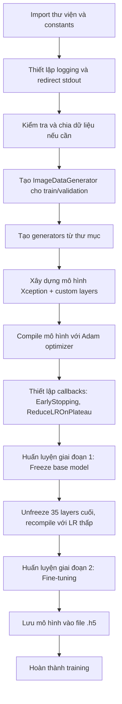

**Giải thích:** Sơ đồ này mô tả toàn bộ quy trình từ import đến lưu mô hình trong `train_model.py`. Mỗi bước được thực hiện tuần tự để đảm bảo mô hình được huấn luyện hiệu quả với transfer learning.

### 2. Sơ đồ Kiến trúc Mô hình (Model Architecture Diagram)

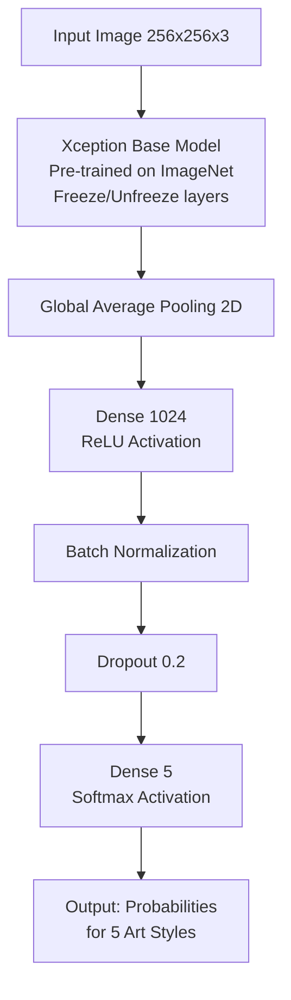

**Giải thích:** Kiến trúc mô hình từ input đến output, sử dụng Xception làm base với các layer custom để phân loại 5 phong cách nghệ thuật.

### 3. Sơ đồ Luồng Dữ liệu (Data Flow Diagram)

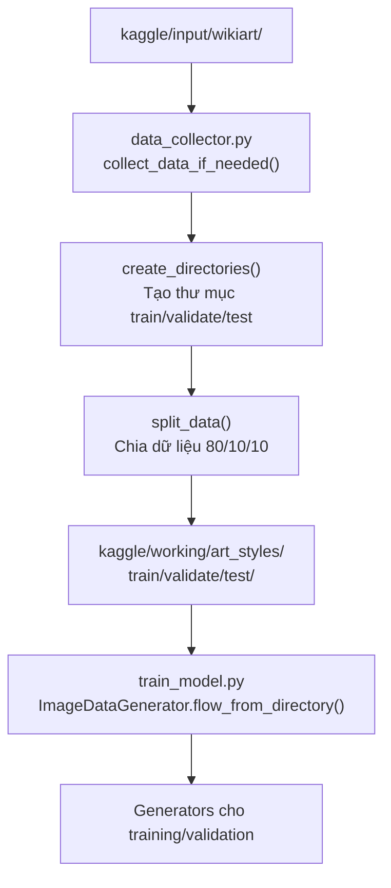

**Giải thích:** Luồng xử lý dữ liệu từ thư mục gốc đến việc tạo generators cho huấn luyện, đảm bảo dữ liệu được chia và tiền xử lý đúng cách.

### 4. Sơ đồ Vòng lặp Huấn luyện (Training Loop Flowchart)

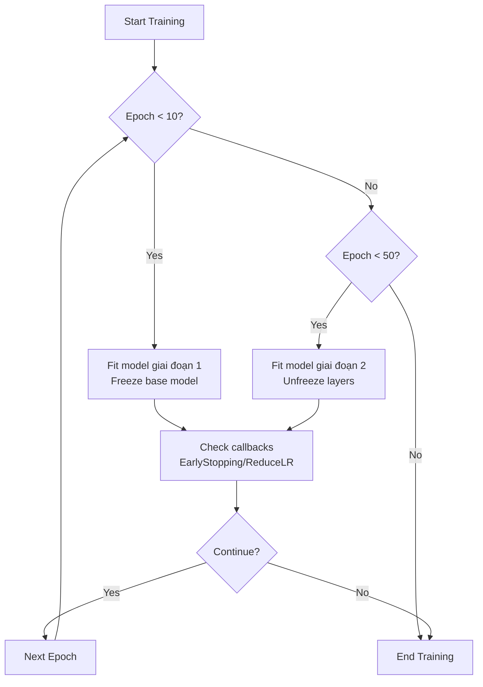

**Giải thích:** Vòng lặp huấn luyện với 2 giai đoạn, callbacks kiểm soát quá trình để tránh overfitting và tối ưu learning rate.

### 5. Sơ đồ Pipeline Kiểm tra (Evaluation Pipeline)

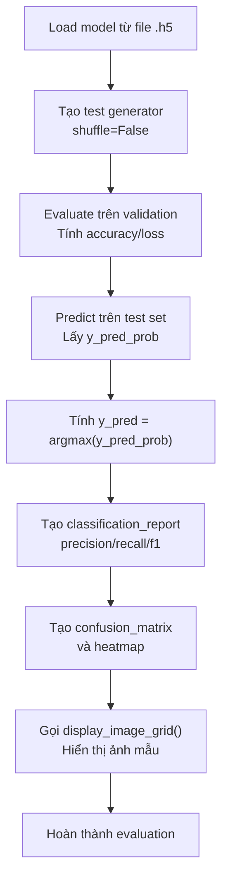

**Giải thích:** Quy trình kiểm tra mô hình từ load model đến xuất báo cáo và visualization trong `test_model.py`.

### 6. Sơ đồ Vòng đời Mô hình (Model Lifecycle Diagram)

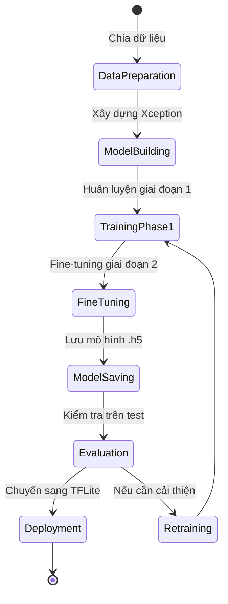

**Giải thích:** Vòng đời mô hình từ chuẩn bị dữ liệu đến triển khai, với khả năng retraining nếu cần.

### 7. Sơ đồ Tiền xử lý Dữ liệu (Preprocessing Pipeline Diagram)

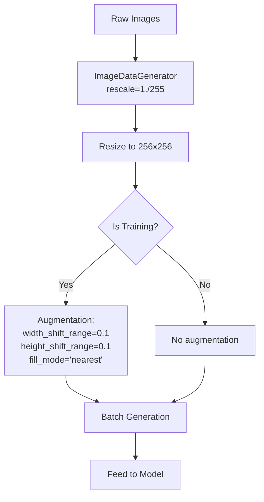

**Giải thích:** Pipeline tiền xử lý ảnh với augmentation chỉ cho training set để tăng đa dạng dữ liệu.

### 8. Sơ đồ Triển khai (Deployment Diagram)

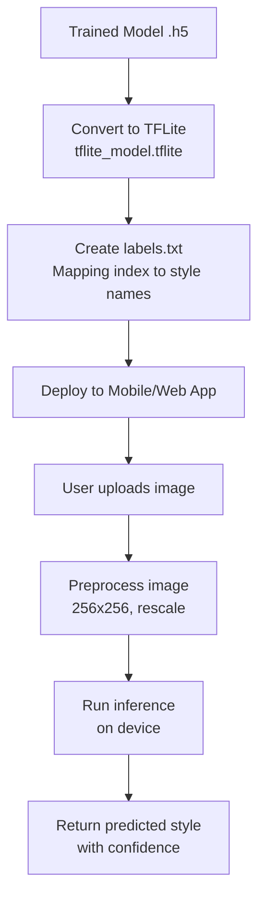

**Giải thích:** Quy trình chuyển mô hình từ training sang deployment trên mobile/web với TensorFlow Lite.

### 9. Sơ đồ Chia dữ liệu (Data Splitting Flow)

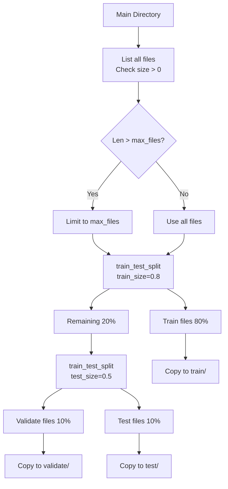

**Giải thích:** Chi tiết cách chia dữ liệu trong `data_collector.py` với kiểm tra lỗi và giới hạn số lượng.

### 10. Sơ đồ Augmentation Process

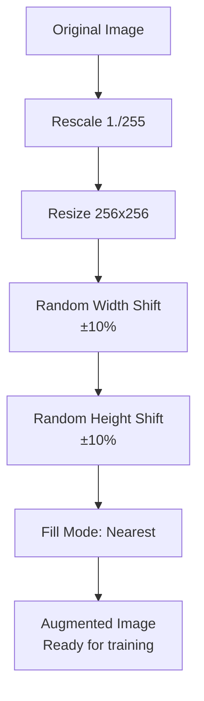

**Giải thích:** Quy trình augmentation để tạo dữ liệu đa dạng, chỉ áp dụng cho training set.

### 11. Sơ đồ Callbacks Flow

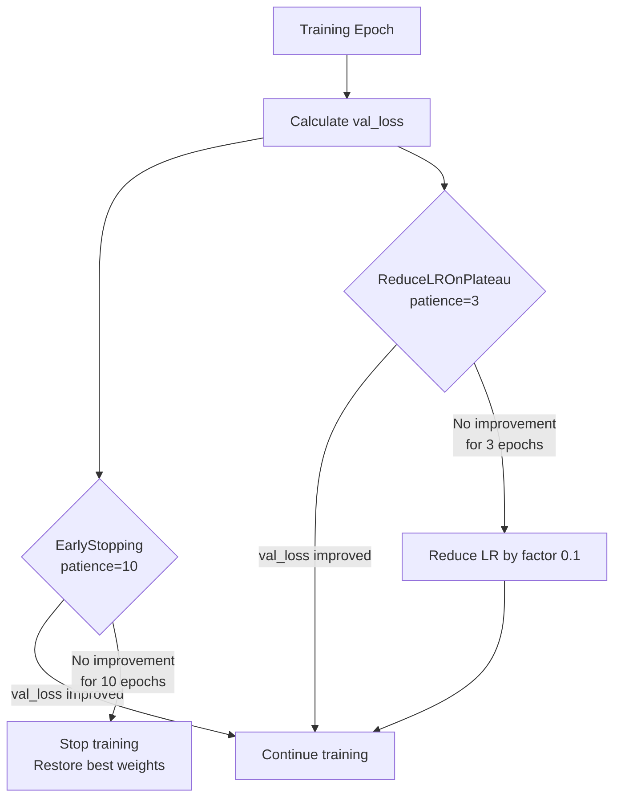

**Giải thích:** Cách callbacks hoạt động để kiểm soát quá trình huấn luyện và tránh overfitting.

### 12. Sơ đồ Confusion Matrix Generation

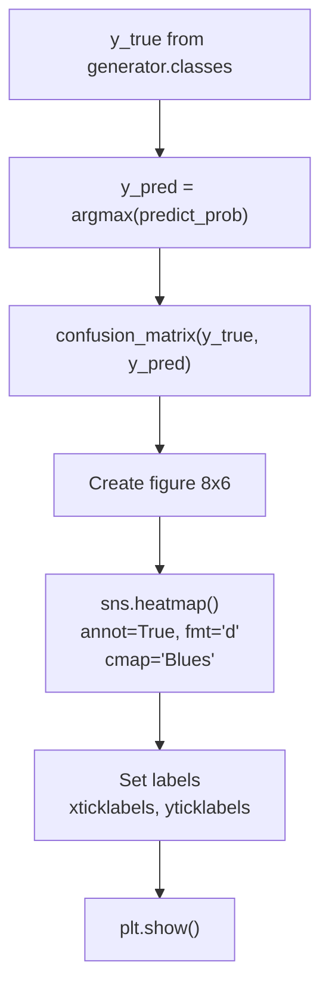

**Giải thích:** Quy trình tạo và hiển thị confusion matrix để đánh giá hiệu suất phân loại.

### 13. Sơ đồ Prediction Loop

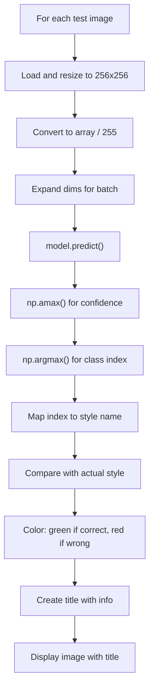

**Giải thích:** Vòng lặp dự đoán trong hàm `display_image_grid()` để hiển thị kết quả trực quan.

### 14. Sơ đồ Logging Setup

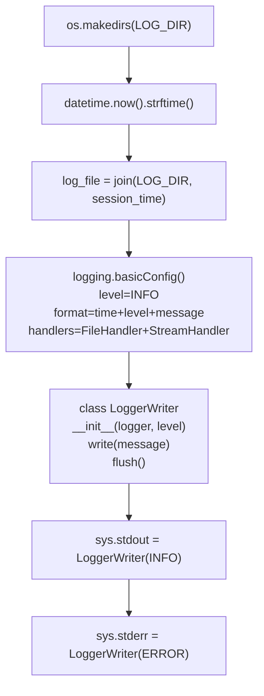

**Giải thích:** Cách thiết lập logging để ghi lại toàn bộ output vào file theo timestamp.

### 15. Sơ đồ Model Compilation

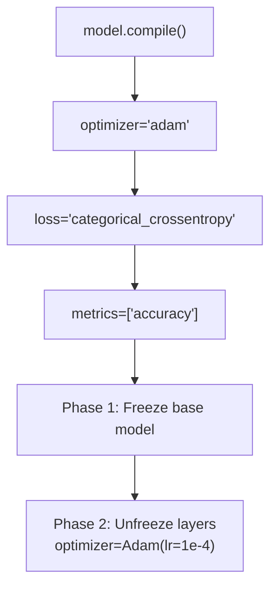

**Giải thích:** Hai lần compile mô hình cho hai giai đoạn huấn luyện với tham số khác nhau.

### 16. Sơ đồ Generator Creation

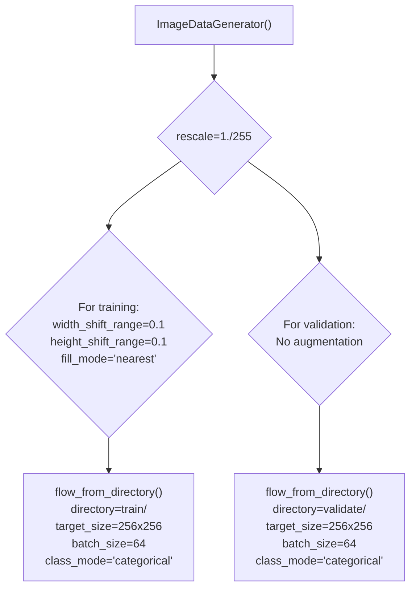

**Giải thích:** Cách tạo generators khác nhau cho training và validation với augmentation phù hợp.

### 17. Sơ đồ Error Handling in Data Collection

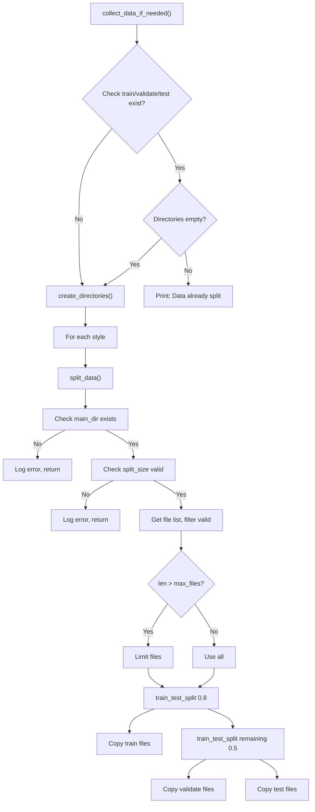

**Giải thích:** Xử lý lỗi toàn diện trong việc chia dữ liệu để đảm bảo robustness.

### 18. Sơ đồ Model Saving Flow

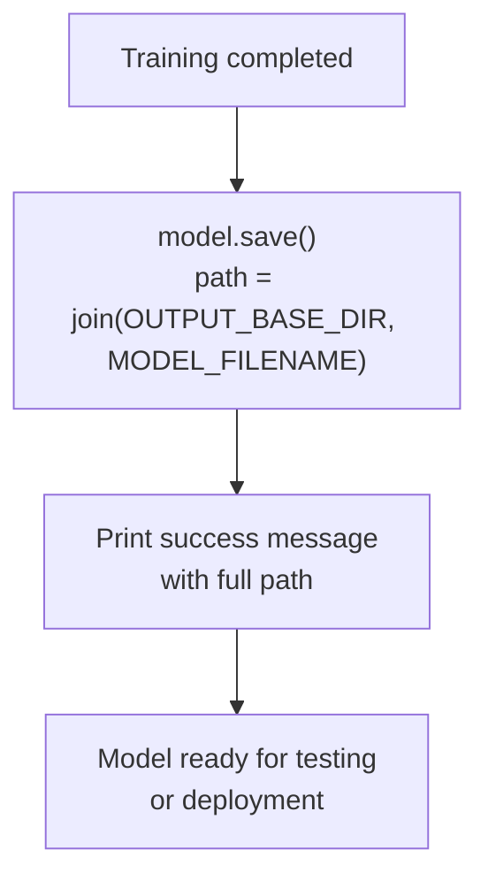

**Giải thích:** Đơn giản nhưng quan trọng: lưu mô hình sau khi training xong.

### 19. Sơ đồ Batch File Execution (02_run_train.bat)

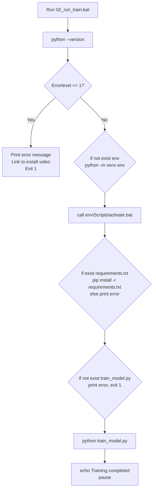

**Giải thích:** Luồng thực thi của batch file để tự động setup environment và chạy training.

### 20. Sơ đồ Visualization Flow

```mermaid
graph TD
    A["display_image_grid()"] --> B["Calculate num_rows, num_cols"]
    B --> C["plt.subplots(num_rows, num_cols)"]
    C --> D["For i in range(n)"]
    D --> E["Random choice style dir"]
    E --> F["Random choice image file"]
    F --> G["image.load_img(target_size=256x256)"]
    G --> H["img_to_array / 255<br/>expand_dims"]
    H --> I["model.predict()"]
    I --> J["np.amax, np.argmax"]
    J --> K["Map to style name<br/>Compare actual vs predicted"]
    K --> L{"is_correct?"}
    L -->|Yes| M["title_color = 'green'"]
    L -->|No| N["title_color = 'red'"]
    M --> O["Create title string"]
    N --> O
    O --> P["ax.imshow(image)<br/>ax.set_title(title, color)<br/>ax.axis('off')"]
    P --> Q["plt.tight_layout()<br/>plt.show()"]
```

**Giải thích:** Quy trình tạo visualization với màu sắc để dễ dàng đánh giá độ chính xác của mô hình.

### 21. Sơ đồ Import Flow

```mermaid
graph TD
    A[Start train_model.py] --> B[Import standard libs<br/>numpy, os, datetime]
    B --> C[Import TF/Keras<br/>models, layers, optimizers]
    C --> D[Import device_lib<br/>Print devices]
    D --> E[Import sys, datetime<br/>for logging setup]
    E --> F[Import constants<br/>DATA_BASE_DIR, etc.]
    F --> G[Try import data_collector<br/>Else print message]
    G --> H[Setup logging<br/>Create log file]
    H --> I[Redirect stdout/stderr]
    I --> J[Continue to data collection]
```

**Giải thích:** Thứ tự import và setup ban đầu trong script training.

### 22. Sơ đồ Memory Management

```mermaid
graph TD
    A[Large dataset] --> B[ImageDataGenerator<br/>flow_from_directory]
    B --> C[Batch processing<br/>batch_size=64]
    C --> D[GPU memory allocation<br/>TensorFlow manages]
    D --> E[Callbacks monitor<br/>val_loss for early stopping]
    E --> F[Model saved periodically<br/>if needed]
```

**Giải thích:** Cách quản lý bộ nhớ khi xử lý dataset lớn với batch processing.

---

> **Lưu ý:** File README này được thiết kế để vừa hướng dẫn chi tiết cho người mới, vừa làm tài liệu tham khảo cho developer, giúp triển khai, mở rộng, bảo trì dự án dễ dàng. Các sơ đồ trên giúp visualize các luồng xử lý phức tạp trong code.